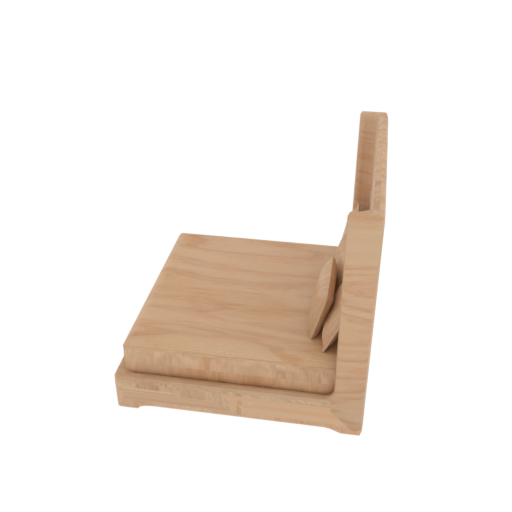
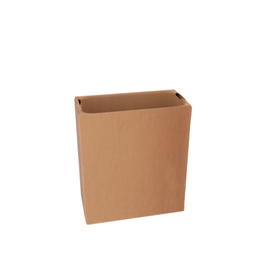
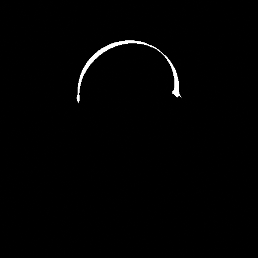
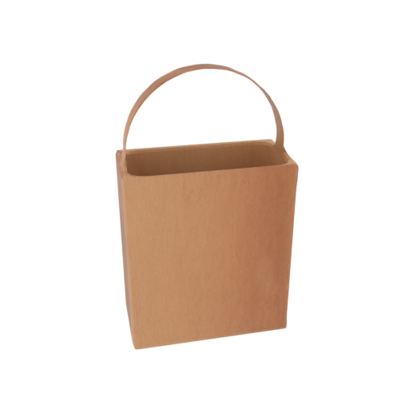

这是一个异常生成流水线，覆盖部件缺失、部件破损，部件凸起，部件凹陷、部件旋转、部件平移六种异常类型！
首先你需要安装blender：


部分部件异常查询图像、mask、正常图像如下：





破损异常运行指令：

```
blender --background --python render/render_broken.py -- --category Mug --num_views 10 --top_k 3 --samples 64 --seed 42
```

缺失异常运行指令：
```
blender --background --python render/render_missing.py -- --category Mug --num_views 10 --top_k 3 --samples 64 --seed 42
```

凸起异常运行指令：
```
blender --background --python render/render_bulge.py -- --category Mug --num_views 10 --samples 64 --seed 42
```
也可以调整参数，长轴、短轴、凸起峰值：
```

```

凹陷异常运行指令：
```
blender --background --python render/render_dent.py -- --category Mug --num_views 10 --samples 64 --seed 42
```
也可以调整参数，长轴、短轴、凹陷峰值：
```
blender --background --python render/render_dent.py -- --category Mug --num_views 10 --samples 64 --seed 42 --dent_min_depth_ratio 0.10 --dent_max_depth_ratio 0.14 --whole_mesh_subdiv_cuts 1
```


旋转异常运行指令：
```
blender --background --python render/render_rotation.py -- --category Mug --num_views 10 --samples 64 --seed 42
```

也可以调整参数：
```
blender --background --python render/render_rotation.py -- --category Mug --num_views 10 --samples 64 --width 512 --height 512 --min_rotation_deg 5 --max_rotation_deg 20 --min_mask_ratio 0.05 --seed 42
```

旋转平移运行指令：
```
blender --background --python render/render_position.py -- --category Mug --num_views 10 --samples 64 --seed 42
```

也可以调整参数：
```
blender --background --python render/render_position.py -- --category Mug --num_views 10 --samples 64 --width 512 --height 512 --min_translation_ratio 0.05 --max_translation_ratio 0.10 --min_mask_ratio 0.05 --seed 42
```
